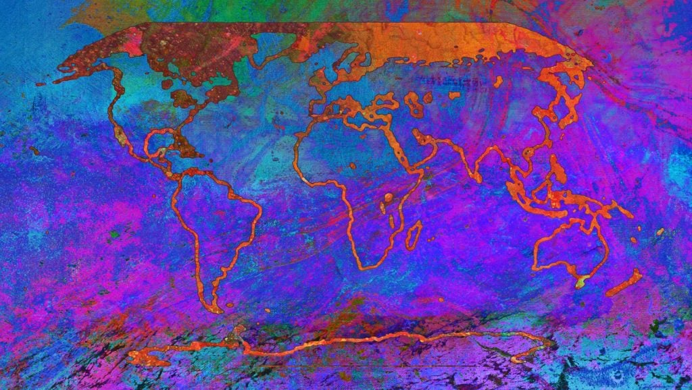
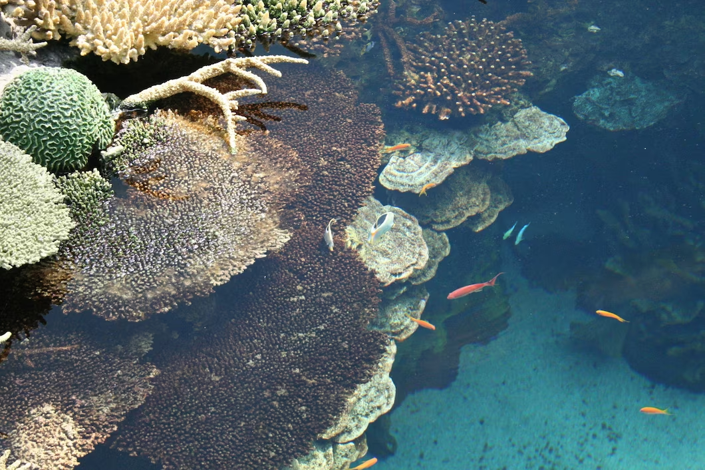

#  # IPCC AR6 完結報告：全球氣候危機將衝擊台灣

[Climate change widespread, rapid, and intensifying – IPCC — IPCC](https://www.ipcc.ch/2021/08/09/ar6-wg1-20210809-pr/)

2023年3月20日，聯合國政府間氣候變遷專門委員會（IPCC）發布了〈氣候變遷2023：總結報告決策者摘要〉（CLIMATE CHANGE 2023: Synthesis Report Summary for Policymakers），終於完成了為期三年的 AR6 （[Assessment Report: 6th](https://www.youtube.com/watch?v=yzmTNoiOtiY)，第六次評估報告) 報告發布時程。

這份 AR6 完結報告整理了這三年發布時程中，由三個工作小組分別發布的三大報告，分別是「氣候科學」（"The Physical Science Basis"）於 2021 年發布、「氣候衝擊、調適與脆弱性」（"Impacts, Adaptation and Vulnerability"）、以及「氣候變遷減緩」（"Mitigation of Climate Change"），後兩份均於 2022 年發布完成。

IPCC AR6 氣候變遷評估報告總結了當前全球科學界對於氣候變遷的最新理解，目的是讓政策制定者獲得充分的資訊，是全球各國制定氣候相關法規的重要依據報告。

AR6 完結報告並非由 IPCC 自行進行的研究，而是由世界各地數百位科學家自願進行調查、討論與撰寫，並且經過多次檢閱審查與修改，目的在於提供公正可信的科學研究成果總結。這份報告發布在氣候變遷領域是一件重要大事。

AR6 完結報告內容主要提出兩大訊息：

一、全球暖化升溫問題和十年前 AR5 報告結論一致，有非常高可信度證據顯示，人為活動造成大量溫室氣體排放，造成極端氣候事件增加、水資源、漁獲、農產下降、森林消失、海平面上升等問題。

二、人類社會必須應對氣候危機進行調適與減緩（Adaptation and Mitigation），透過教育民眾氣候危機意識、減少傷亡、加強永續發展概念等。同時先進國家也應該將製造技術和科技轉移至開發程度相對較低的國家，協助共存共榮。

以下我們摘錄更多報告中的重要內容，以及台灣學者的看法：

## 生物多樣性與珊瑚礁危機

[https://www.freepik.com/free-photo/beautiful-colorful-small-fishes-swimming-tank_14191617.htm#query=coral reef&position=1&from_view=search&track=ais](https://www.freepik.com/free-photo/beautiful-colorful-small-fishes-swimming-tank_14191617.htm#query=coral%20reef&position=1&from_view=search&track=ais)

AR6 完結報告中提到，氣候變遷會對生態系統和生物多樣性造成衝擊，並且指出脆弱的熱帶珊瑚生態系將是地球上第一個消失的生態系統。

如果平均溫度升高超過 2 度， 99％ 以上的全球珊瑚礁均面臨消失風險。如果能在2050年前控制在升溫 1.5 度之內，則有機會保留 10-30％ 的珊瑚礁。

因此，報告指出在努力減排溫室氣體的同時，我們也應該找出哪些珊瑚生態系統是這些潛在的 10-30％，超前部署保育投資。

台灣四面環海，在綠島、墾丁、蘭嶼、東北角皆有豐富多樣的珊瑚生態系統，提供觀光經濟、科學研究重要資源。如何協助台灣的珊瑚生態系統面對氣候變遷的衝擊，在自然生態和觀光發展之間取得平衡，成為那 10-30％ 的存活珊瑚礁，是非常重要的自然資源保育問題。

## 海洋漁業資源浩劫

[https://www.freepik.com/free-photo/shoal-fish-underwater_1115927.htm#query=fish&position=47&from_view=search&track=sph](https://www.freepik.com/free-photo/shoal-fish-underwater_1115927.htm#query=fish&position=47&from_view=search&track=sph)

氣候變遷對中低緯度地區影響尤其巨大，並以海洋暖化和酸化對漁業和水產養殖業首當其衝。

漁獲量減產對熱帶地區來說是糧食安全問題。氣候變遷正在導致小型洄游性魚類和頭足類漁場的分布位置改變，進而影響漁業資源量和漁場適合度，而熱帶國家大多數的漁業都是家計型漁業，亦即其漁撈生產主要支持當地人民營養來源及生計，一旦漁獲量降低，會直接危及當地居民的營養來源。

國立台灣海洋大學李明安教授團隊長期觀察台灣周邊海域的海表水溫變化，指出台灣周邊海洋暖化趨勢已十分明顯，特別是近 20 年間，東海南部海域增溫最大可達2.06℃。海洋暖化嚴重影響了台灣沿近海漁業漁獲量，自 1980 年至今已減產達55%。

氣候變遷已經對沿海和海洋生態系造成重大破壞，迫切程度已非[目標 2050 年達成淨零](https://combogic.com/blog/2050-net-zero-roadmap.html)即可以解決的問題，而是現在就必須要做出應對的危機。

## 氣候變遷已經是全球危機

[https://www.freepik.com/free-photo/stubble-burning_921812.htm#query=forest fire&position=38&from_view=search&track=ais](https://www.freepik.com/free-photo/stubble-burning_921812.htm#query=forest%20fire&position=38&from_view=search&track=ais)

AR6 完結報告總結多項科學證據，從大氣、地層、冰層和生物圈等觀測資料，都顯示全球暖化正在發生中，並且這些結論可信度都非常高。

這次 AR6 完結報告直接針對全球在升溫 1.5、2、3、4 度的各種情境中可能產生的氣候負面影響進行討論，且這些負面影響發生的時間點不是 2100 年，是會大幅提前在 2020~2030 間顯現出來。

中央研究院經濟研究所兼任研究員 蕭代基表示，氣候變遷已經是氣候危機。在 2020~2030 這個十年窗口中，全球各國需要加強減量行動，否則若升溫達到不歸點之後，寒帶多年凍土融化，釋放凍土儲存的有機碳，將開啟氣候變遷的正回饋圈，造成不可逆轉的極端氣候危機。

目前各國雖然都有宣布 NDC 國家自主貢獻，但各國的政策內容、實質行動皆與 NDC 的承諾目標差距非常大。如果在這十年間不加強減量政策，本世紀末暖化程度可能升溫超過 3 度，屆時氣候變遷進入不可逆的極端風險路徑，人類文明將無法存續。

## 自然為本的調適方法

IPCC AR6 完結報告特別肯定，「自然為本的調適方法」如城市綠化、恢復自然地景和生態系統等，能有效降低洪水和高溫風險。從森林經營或防災的角度來看，這是一個非常鼓舞人心的科學訊息。

然而，當前世界各國的積極程度仍有所不足，因此未來在相關政策和措施的強度必須進一步提升。

## 淨零綠運輸

[https://www.freepik.com/free-photo/trucks-highway-mountain-sunset_31177932.htm#query=fleet&position=20&from_view=search&track=sph](https://www.freepik.com/free-photo/trucks-highway-mountain-sunset_31177932.htm#query=fleet&position=20&from_view=search&track=sph)

AR6 完結報告指出，能源、工業、運輸及建築四大部門為碳排之首，總共佔 2019 年全球 79% 的溫室氣體排放。然而從 IPCC 的路徑模型來看，運輸部門是時程上較晚才能達到淨零排放的部門之一。

有鑑於此，IPCC AR6 總結報告強調必須從需求面對運輸部門進行減碳，各國政府在致力於運具電動化的同時，亦需要提升大眾運輸與主動運輸（如步行、騎自行車）的使用，從使用者端減少整體電力需求。

臺灣的十二項關鍵戰略中，運輸部門以第七項「運具電動化及無碳化」與第十項「淨零綠生活」中的低碳運輸網絡為行動計劃準則。國立成功大學交通管理學系助理教授 鄭祖睿認為，以本次IPCC AR6總結報告做為參考，可看出臺灣運輸部門的策略著重在市場較成熟之電動汽機車產業，和以供給端出發的交通運輸建設或推廣政策。至於使用者端為觀點的策略則尚未見有成果。

櫛構科技產品 CHAP-V 致力於從使用者端交通運具駕駛行為出發，以 AI 結合 GIS 演算法，分析車輛駕駛行為，並提供以[節能駕駛為導向](https://combogic.com/blog/eco-driving-case.html)的減碳策略。

## 與台灣的關係

[https://www.freepik.com/free-photo/beautiful-landscape-cityscape-taipei-101-building-architecture-city_6899642.htm#query=taiwan&position=20&from_view=search&track=sph](https://www.freepik.com/free-photo/beautiful-landscape-cityscape-taipei-101-building-architecture-city_6899642.htm#query=taiwan&position=20&from_view=search&track=sph)

AR6 完結報告呈現的是全球尺度的地球環境，整個第六次評估與海洋相關的報告（也是報告特別強調的主軸），對於台灣是極為重要的一部分。

在氣候危機逼近之下，台灣整體社會如何正視即將迎來的衝擊，同時產生要求改變的集體意識，這些才是最需要盡快解決的問題。

國內「氣候變遷因應法」已於 2023 年 2 月正式公告，2050 淨零排放目標、調適專章、碳定價與審議等概念皆以入法，這是台灣在國際進度上的一大步，但在落實氣候法立法精神上，我們還有非常大的進步空間。

例如，行政院於 2022 年 3 月公布的「臺灣 2050 淨零排放路徑及策略」以及 2022 年 12 月公布的「淨零轉型十二項戰略」宣示 2030 年減碳目標為相較2005年溫室氣體排放量減少24%±1%，此目標以及此路徑策略，從 AR6 的分析角度來看，都因為擔心降低產業競爭力與經濟發展而過於保守。

但事實上，已有很多[文獻](https://www.mckinsey.com/capabilities/sustainability/our-insights/how-companies-capture-the-value-of-sustainability-survey-findings)、[案例研究](https://www.mckinsey.com/featured-insights/sustainable-inclusive-growth/our-future-lives-and-livelihoods-sustainable-and-inclusive-and-growing)指出，減少能源消耗、促進循環經濟、責任原則投資等不僅能改善環境品質，長期來看還能刺激產業迭代，反而增加國家和產業的國際競爭力。

因此永續轉型已是當今台灣在國際產業競爭中的重要節點。在這個環節中，[數位轉型與數據治理](https://combogic.com/blog/south-east-asia-esg-status.html)是至關重要的角色。企業已然知道數據對於營運的重要性，但是在永續方面，相關數據採集與分析仍然非常陌生。櫛構科技致力於使用資料科學，協助企業從數據治理出發，達成數據永續的目標。

除了隨手關燈，我們可以做更多。

## 參考資料：

[「IPCC AR6 總結報吿」專家意見](https://smctw.tw/15420/)

[SYNTHESIS REPORT OF THE IPCC SIXTH ASSESSMENT REPORT (AR6) Summary for Policymakers](https://report.ipcc.ch/ar6syr/pdf/IPCC_AR6_SYR_SPM.pdf)