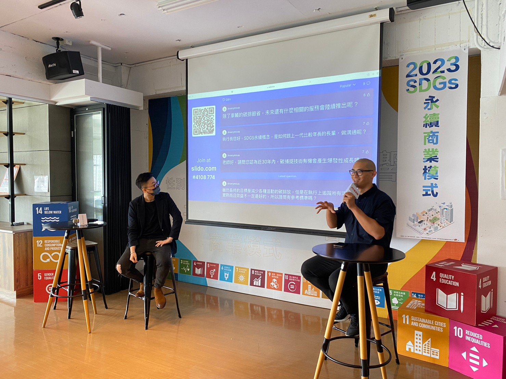

櫛構科技行銷總監周加恩（圖右）近日應邀參與台中社會創新實驗基地主辦之「2023 SDGs 永續商業模式」活動，與參與者進行熱烈的問答互動。

台中社會創新實驗基地在2023年8月20日舉行的「2023年 SDGs 永續商業模式」活動引起了廣泛關注。

這場活動聚焦於社會企業領域，匯聚了多位優秀的企業家，包括奉茶行動、生命之星國際、味榮食品工業股份有限公司、玩艸植造、幸福千千歲等六位創辦人，他們紛紛分享了企業的核心理念以及獨特的商業模式。 

作為本次活動的特別嘉賓，櫛構科技（Combogic Tech.）同樣受邀參與，並由其行銷長周加恩進行了富有啟發性的演講。周加恩針對企業社會責任（ESG）、碳市場和碳權議題進行了深入解說，強調了這些議題對於企業永續發展的重要性。此外，周加恩更細致介紹了櫛構科技所運用的非監督式機器學習演算法在車輛碳管理領域的應用，並強調該技術的卓越成果。

演講結束後，聽眾對於周加恩的演講反應熱烈，紛紛提出問題，探討永續商業模式、科技創新和碳管理等重要議題。櫛構科技團隊在現場進行了深入的互動和解答，充分展現了他們在這些關鍵領域的專業知識和經驗。 

櫛構科技感謝台中社會創新實驗基地的邀請，並對參與者的熱情參與表示感激。我們將不懈努力，繼續致力於探索創新技術解決方案，並與合作夥伴和客戶共同合作，提供卓越的減碳產品和服務，支持台灣實現2050年淨零碳排的目標。