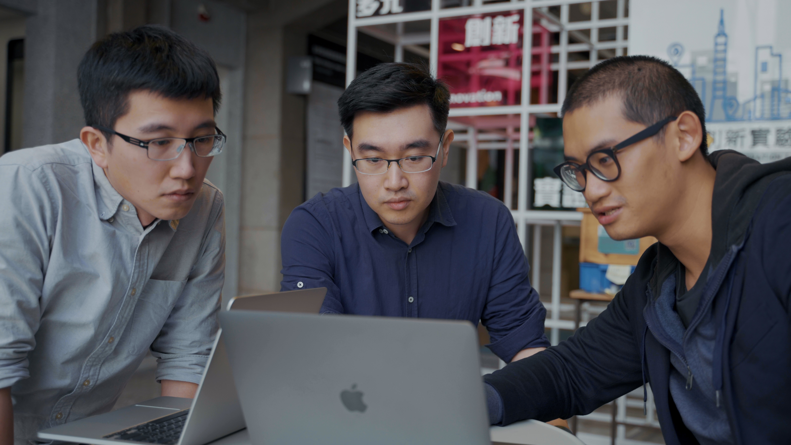

# 櫛構科技：以 AI 運算驅動企業減碳策略

隨著 AI 技術運用範疇擴張，各領域皆在探索將 AI 技術運用於自身業務，以獲得更佳效益與競爭優勢，永續領域也不例外。

[經濟部商業部門 2030 淨零轉型路徑報告書](https://www.moea.gov.tw/MNS/populace/news/News.aspx?kind=1&menu_id=40&news_id=103156)中，政府也倡議商業部門應導入 AI 或 IoT 智慧科技及運用資料探勘，並特別提及物流業應導入智能運算提高工作效率並優化配送路線，以減少能源使用。

櫛構科技的 CHAP-V 系統，乃基於 AI 運算的創新性解決方案。透過資料搜集與探勘，我們可協助企業更佳了解自身碳排放狀況，提供精確的減碳策略，協助企業加速永續轉型進程。

ESG 轉型挑戰，實質上是企業治理文化與資料洞察的數位轉型綜合挑戰，需要許多技術創新結合才能完成。櫛構科技所研發的 AI 碳管理解決方案，能夠協助企業做到從數據治理出發，提升企業韌性，達成數據永續的共同願景。

## CHAP-V 以數據驅動減碳策略

櫛構科技的研發核心「運具高解析碳資料AI分析平台」 (CHAP-V; Carbon High-res AI-analysis Platform - Vehicle）(下稱 CHAP-V ) 是企業可立即部署的 SaaS 雲端服務平台，不需改變企業本身營運流程，只要透過手機 App 搜集 GPS 軌跡即可進行減碳分析與管理。

CHAP-V 主要鎖定企業車輛減碳議題，目標市場為即將受台灣法規要求盤查與徵收碳費的1,744家上市櫃公司，針對其內部的員工通勤、公務車、商務差旅，以及上下游合作的36,180家物流公司、計程車、運輸業者與具有車隊的供應鏈企業。

針對交通運具減量目前主流的方案為換購電動車與使用再生能源。但按照目前台灣的能源發展現況，在真正實行全電動車以及全綠能發電前，除了仰賴政府能源轉型以外，企業需要現在即可部署的減碳方案。

## 推動企業自動化碳排放管理工具

櫛構科技 CHAP-V 自動化碳管理流程，將「碳資料搜集、碳盤查、碳減量策略制定」等繁瑣過程統一於平台，將行車資料自動上傳至平台，計算旅程碳排放量，並依照車隊駕駛行為與路線透過演算法交錯分析提供 AI 驅動的減碳策略，大量減少了人工執行時間與人為錯誤率。

除了自動化解決企業現行手動收集油單收據盤查耗時以外，CHAP-V 最大的創新點在於採用非監督式 AI 演算法和 GIS 圖層技術，解耦車輛行為與碳排放量之因果關係，精確標記造成高碳排的因子，提供數據驅動的精準減量策略。

為何資料可以減碳？其實人為的駕駛有決定性的差別。這個差別的來源，在於駕駛行為是否符合「節能駕駛」。

節能駕駛是一套藉由訓練司機的駕駛技巧，來最優化燃料使用效率，並且藉由流暢的駕駛行為降低事故率、降低空污、節省燃料成本、降低碳排放。在歐洲節能駕駛是相當成熟的車隊訓練項目之一，有許多駕駛學校以及車隊的培訓服務皆以節能駕駛為導向。研究指出節能駕駛有 10~25% 的優化效益，而在實際案例結果皆顯示出 6~8% 的效益。

CHAP-V 即是一套數位節能駕駛教練，藉由 GPS 資料軌跡洞察駕駛行為，以非監督式 AI 運算協助車隊提升節能駕駛表現。

台灣 2024 年即將開徵碳費，企業需要所有可以部署、應用的減碳方案。櫛構科技推出 CHAP-V 在過去難以執行任何減碳策略的運輸領域，提供一個從駕駛行為、車隊管理方面著手的減碳方案，不只減少碳排放，也節省燃料成本、降低車隊事故率、降低維修成本、協助城市減少空污，讓企業在 ESG 轉型同時提升營運表現。

櫛構科技致力於推動聯合國永續發展目標於企業中，節能減碳不是一個花錢做環保的公關開銷，而是公司走向數據治理的重要轉型進程。除了隨手關燈，我們可以做更多。