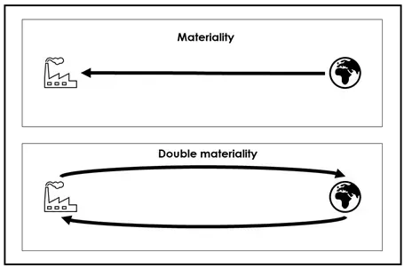

# ESG 到底是不是環保？雙重重大性議題

https://www.globalreporting.org/news/news-center/understanding-materiality-can-unlock-accountability/

ESG 風潮熱起，許多企業都在忙著做永續、減塑、認養種樹...一窩蜂地開始要「做環保」。

但是有時我們也會聽到人說， [ESG 跟環保其實沒有太大關係](https://udn.com/news/story/6811/6359478) 。那，究竟是怎麼回事呢？

在[上一篇文章](https://combogic.com/blog/materiality-explained.html)中我們討論了「重大性議題」，就是「對於一間公司所有利害關係人都非常重要」的議題。

例如，一間作遠洋漁業的公司，可能就特別容易受到環境面氣候變遷、[海洋暖化的威脅](https://combogic.com/blog/ipcc-ar6-what-to-know.html)導致財務受損，且所有利害關係人都非常在意氣候變遷如何影響公司營運，因此氣候議題可能就是這間公司的重大性議題。這是 ESG 風險評估的主要目的：辨認環境（Ｅ）、社會（Ｓ）、治理（Ｇ）三大面向潛在的風險，並且超前部署提升企業韌性。

但你可能會問，ESG 如果只是評估「環境對企業」可能產生的風險，又為何永續報告書都要寫「企業對環境」所產生的衝擊呢？

要回答這個問題，我們就必須來討論一下「單向重大性」與「雙重重大性」的區別。

## 單向跟雙重，差在哪？

傳統上，ESG 只是一種風險評估標準，這套標準只在乎「環境對企業產生的風險」，關注一間企業在「環境、治理、社會」三面向動盪時的生存機率，也就是「企業韌性」。

這類只在乎「環境對企業」的風險評估方法，也被稱為「單向重大性議題」（single materiality）。

而「雙重重大性」如同字面意義，就是同時看「環境對企業」的風險，也看「企業對環境」的風險。

https://www.lse.ac.uk/granthaminstitute/news/double-materiality-what-is-it-and-why-does-it-matter/

在 ESG 概念發展初期，雙重重大性並未受到太多關注，大部分公司只關注環境、社會、治理三面向如何影響企業財務表現 。

但近年來國際間越來越重視企業營運過程中對環境產生的衝擊。例如歐盟在 2019 年已經將「雙重重大性議題」（double materiality）納入歐洲永續報告書標準（European Sustainability Reporting Standards）。

甚至更進一步地，歐盟也將雙重重大性的精神入法，在 2024 年開始強制要求企業永續報告書必須納入雙重重大性評估方法，充分揭露企業活動對環境的衝擊。

而目前，許多永續報告書框架例如 GRI、SASB 等都已經具備雙重重大性的框架，要求企業在評估環境風險的同時，也必須揭露自身在環境、社會、治理三個面向對外產生的衝擊。

然而即便雙重重大性的共識已經漸漸形成，國際上各家 ESG 評級機構的標準不一的問題仍然存在。有些機構更注重於「環境對企業的風險」，[例如 MSCI、Sustainalytics](https://www.financierworldwide.com/esg-ratings-key-considerations-for-stakeholders)，而有些則更注重於「企業對環境的衝擊」，例如 Refinitiv。

這樣的標準不一，把投資人可搞糊塗了。

例如，假設某間保險公司已經充分做好碳盤查，甚至在碳足跡減量上都有遠超出業界的表現，且都透明揭露在永續報告書中；但是該公司的保險涵蓋範圍有大量容易受到天災影響的房產物產，使得劇烈的環境波動可能會直接影響該公司的財務表現。

那在在 環境（E）方面，那些注重「環境對企業風險」的 ESG 評級就會給這間保險公司低分；然而在注重「企業對環境衝擊」的 ESG 評級中，反而會保險公司高分。

這樣的混亂，是現行 [ESG 評分最大的爭議](https://combogic.com/blog/anti-esg-movement.html)，也是大量矛盾資訊困擾投資人的原因。在 ESG 發展中，如何統一標準，讓投資市場運作更順暢是現下國際永續領域的重大挑戰。

## 那又什麼是「財務重大性」、「衝擊重大性」？

https://www.globalreporting.org/media/r2oojx53/gri-perspective-the-materiality-madness.pdf

有時你會聽到「財務重大性」與「衝擊重大性」，有時會聽到「雙重重大性」。這是用詞內捲問題，事實上沒有那麼複雜，可以直接說「財務」＋「衝擊」＝「雙重重大性」。

財務重大性主要來自 ISSB 框架（參考自 TCFD、SASB等會計系統），注重的是「環境對公司」的財務影響，基本上就是過去的單一重大性；而衝擊重大性則來自 GRI 框架，注重「公司對環境」的衝擊。

## 為何雙重重大性重要？

從風險評估的角度來看，「財務重大性」（單一重大性）討論環境、社會、公司治理的動盪對公司的財務影響，這個重要性不言而喻。

但是，雙重重大性新增的「衝擊重大性」，評估企業對環境的衝擊，是否就只有道德上與企業社會責任的這些「高大上」的意義呢？

事實上，雙重重大性在實務上，也對商業策略非常重要。

一是公司企業對外的衝擊也有可能會被轉化成財務風險，例如公司排放廢水、治理階層醜聞皆可能導致商譽受損、面對法律風險與罰鍰等。類似這樣務實的財務考量，也被稱為雙重重大性的弱概念。

二則是永續意識逐漸提升，不論消費者或投資人相比以往都要更重視企業的永續表現，對於重視「責任投資原則」（PRI）的投資人來說，財務表現不是投資決定的唯一主要考量，一間企業創造多少社會價值，也會影響投資決定。

而對於其他利害關係人例如消費者、客戶、合作夥伴等，企業的永續形象也越來越重要。

杜倫大學商學院進行的文獻總結也指出，企業針對自身具有重大性的環境衝擊議題完整揭露並且進行永續投資，長期來看可以提升財務表現。換句話說，「永續」已和以往的「搞環保就是燒錢」概念不同，是一種[短期高成本，長期高效益的投資](https://combogic.com/blog/content_0.html)。

我們需要認清楚 ESG 本質是一種風險評估手段。讓我們將「做環保」、「社會責任」的標籤暫時拿下來，更加深刻認知何謂「風險」。

第一層的風險評估，是環境、社會、治理三個面向的動盪將會如何影響企業的財務表現，找出關鍵的「重大性議題」，並從中評估企業如何做風險管理。

而第二層則是更長遠的風險思考：當企業自己不斷對環境造成衝擊時，甚至對此盲目不見的時候，這些衝擊將這如何影響整體社會，最後反噬到自身。

這一層的風險思考需要高層次的策略思維與[賽局觀念](https://combogic.com/blog/gametheory-net-zero.html)。甚至更高難度的，是要將這樣的風險思維在企業內部溝通徹底，讓永續轉型不是只有專案小組的事，是所有人的事。

而辨認清楚重大性議題，做好溫室氣體盤查都只是第一步。就如同減肥必須先量體重，但是真正困難的是後續的減肥，不是站上體重計。

面對日益嚴峻的減碳挑戰，我們可以借助科技的力量。AI 模型演算法在各種領域都能有效協助企業減排。例如運用演算法進行能源消耗的預測和優化，從而減少浪費；運用 AI 模型能監測污染源降低污染等。

櫛構科技致力於開發可以規模化跨場域的減碳解決方案，透過AI技術創新與ESG專業知識結合，得以協助企業落實減碳行動，減碳不再僅是永續報告書的文案競賽。

企業也應該運用各式各樣目前已有的方法進行減碳，例如[內部碳定價](https://combogic.com/blog/internal-carbon-pricing.html)、推動企業車輛[節能駕駛訓練](https://combogic.com/blog/eco-driving-case.html)、智慧工廠等。

然而完整揭露企業非財務資訊並不是一件簡單的事，界定企業對環境的影響哪些是真正「重大」可以相當耗時費工，不只包含為數眾多的利害關係人，也考驗企業對自身活動的掌握度，以及數據治理能力。更甚的，這些複雜性與模糊地帶也讓第三方的查證與確信成為高難度作業，這些皆是目前企業要落實雙重重大性於永續報告書中會面臨的挑戰。

[櫛構科技](https://combogic.com/) 具備十餘年資料科學與人工智慧經驗專業團隊，我們致力於運用 AI  演算法協助企業減碳，強化數據治理能力，達成「數據永續」的願景，在 ESG 浪潮中搶得先機。

除了隨手關燈，我們可以[做更多](https://combogic.com/)。

## 參考資料

[‘Double materiality’: what is it and why does it matter?](https://www.lse.ac.uk/granthaminstitute/news/double-materiality-what-is-it-and-why-does-it-matter/)

[gri-perspective-the-materiality-madness.pdf (globalreporting.org)](https://www.globalreporting.org/media/r2oojx53/gri-perspective-the-materiality-madness.pdf)

[GRI - Understanding materiality can unlock accountability (globalreporting.org)](https://www.globalreporting.org/news/news-center/understanding-materiality-can-unlock-accountability/)

[#5 Materiality Matters ESG Explained | Article series exploring ESG from the very basics](https://www2.deloitte.com/hu/en/blog/esg-explained/2021/esg-explained-5-materiality-matters.html)