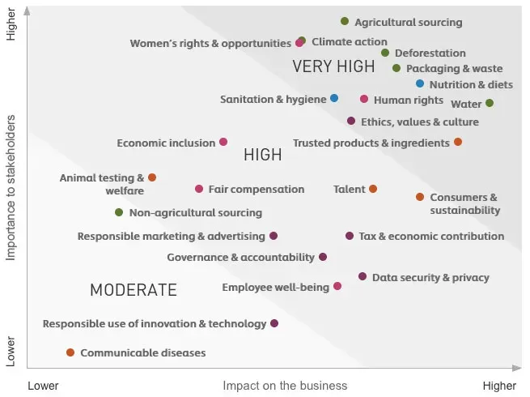

# 永續報告書核心關鍵：重大性議題

https://www.freepik.com/free-photo/gears-cogwheels_1026582.htm#query=machine&position=4&from_view=search&track=robertav1_2_sidr

重大性議題（Materiality）是一份永續報告書的最核心關鍵，但究竟什麼是「重大性」卻並非所有人都充分理解。

甚至有時候撰寫永續報告書的單位也只是照著上課所學，發一發問卷，畫出一張矩陣圖，就完成了重大性評估，卻還是不明白重大性對於公司的意義。

究竟什麼是「重大性議題」？要如何做好一份「重大性評估」？「重大性矩陣圖」有什麼意義？

這篇文章，我們一起來探索重大性議題，究竟「重大」在哪裡。

## 何謂「重大性議題」（Materiality）？

https://www.freepik.com/free-photo/asian-thinking-lady-standing-isolated_6695887.htm#query=thinking&position=0&from_view=search&track=robertav1_2_sidr

重大性議題的定義是：「任何能夠影響投資人決策的關鍵資訊」。

ESG 相關的議題百百種，對於一間特定的公司來說，絕不會是所有議題都與這間公司息息相關。例如，資安議題對於做電商的公司來說非常重要，但是對於做水產養殖的公司而言就可能還好。

傳統財務分析上，重大性只是關於會影響投資人的資訊。然而到近年來，重大性的對象逐漸擴張到「所有利害關係人」，因此任何會顯著影響利害關係人意願，例如影響股東的投資意願、影響員工的工作意願、影響消費者的消費意願等等相關資訊，即是重大性議題。

我們用一個更白話文的方式來討論「重大性議題」。

想像這樣一個情境：妳和男友交往了三年，差不多到論及婚嫁的時候了。

但是，很快地妳也發現，結婚不只是兩個人的事。妳的父母、他的父母、你的姐妹、他的兄弟、過年見一次面的遠親、甚至他家那隻鬥牛犬，都對於妳是否結婚有許多意見。

而誰的意見更重要呢？誰的意見不重要呢？幾番思索之下，你決定這段關係應該只顧慮到雙方家長的意見就好，至於兄弟姐妹、遠親與鬥牛犬就謝謝再聯絡。

這個過程，就是「辨認利害關係人」。將不相干的關係人不予考慮，只留下真正重要的，對這段婚姻有利害關係的他人。

而當利害關係人確定了，再來要思考的是「這些人在乎什麼？」。

也許妳的父母在乎對方的信仰背景，認為非教會弟兄不可嫁；也許他的父母在乎門當戶對，要經濟實力相當才好....信仰、收入、價值觀、健康狀況、身高體型、長相、家庭背景、甚至星座血型生辰八字...這些就是父母們（利害關係人）可能會在乎的議題。

於是特別謹慎的妳，廣泛收集與探聽種種雙方家長可能會在乎的議題，並且經過深度訪談（一起吃頓飯）後發現，雙方家長共同在乎的，是男女方的健康狀況與經濟實力。其餘星座、血型、身高體重長相...等都不太在乎，雙方合意就好。

於是「健康狀況」與「經濟實力」這兩項資訊，就是這段婚姻的「重大性議題」，因為這兩項資訊的揭露會直接影響雙方家長（利害關係人）是否同意結婚的決定，具有「重大性」（materiality）。

而就這樣，從一開始的探聽、蒐集可能議題到後續的飯局深度訪談，妳也已經走完了一輪 GRI 重大性評估流程：「鑑別：搜集議題」（發想有哪些資訊可能重要）、「排序：分析議題」（確認各方家長怎樣想）、「確認：重大議題」（達成雙方家長共識）。

我們生活中時常進行這樣的重大性評估流程而沒有自覺，但是當分析的對象來到一整間企業時，這件事就顯得複雜許多。

當然複雜，兩家婚姻都時常搞不定了，何況一間企業動輒數百數千利害關係人。

好在，即便複雜，仍有許多方法可以克服。

## 重大性議題步驟

https://www.freepik.com/free-photo/low-angle-view-unrecognizable-muscular-build-man-preparing-lifting-barbell-health-club_25743546.htm#query=heavy&position=47&from_view=search&track=robertav1_2_sidr

一般來說，要決定自身公司的重大性議題，方法不出為針對不同利害關係人普發問卷進行調查，並且根據各議題的利害關係人關注度與營運衝擊度（即，如果公司在該議題上搞砸了，會多大程度影響公司營運）畫出重大議題矩陣圖。

### 辨別利害關係人

進行重大性議題之前必須要做的步驟，就是辨認出與公司息息相關的「利害關係人」。通常最基本的分群，是分成「內部」與「外部」利害關係人，內部可能就是員工、股東、各階層管理職等，外部則多為客戶、社會、供應鏈合作廠商、政府單位等。

辨別利害關係人的過程也常被稱為「利害關係人分析」，用意是針對與企業活動息息相關的不同對象進行分群，方便後續重大性議題評估。

### 發想重大性議題

辨識完厲害關係人後，就需要針對可能的重大性議題進行發想。這方面一般來說會參考 [GRI 準則、聯合國發展目標（SDGs）、SASB ](https://combogic.com/blog/esg-report-key-concepts.html)等框架，均有提供依照產業別分類的潛在重大性議題可供參考，或者也可以參考其他同業的重大性議題分析。

永續報告書的撰寫人在這個階段必須將這些潛在重大性議題設計成問卷與深度訪談的訪綱，方便後續的調查進行。

### 實際調查

最理想的情況下，是針對內部與外部利害關係人均進行量化的問卷調查，以及選出焦點小組進行質性分析的深度訪談。

然而，通常實際情況是時間與資源皆有限度，一般能夠接受的理想標準，是只針對內部利害關係人進行量化問卷與質性訪談，而針對外部利害關係人則只進行廣發問卷調查，取得泛化的資料。

問卷與訪談、焦點小組可能並非唯一辨識重大性的方法。國外目前也有些公司針對特定領域提供社群媒體與新聞報導的監控，協助該產業企業隨時追蹤領域限定的重大性議題。

### 整理結果並繪製重大性矩陣圖

在完成大量調查後，永續報告書撰寫人就可以將調查結果整理成一份「重大性矩陣圖」，將大量資料視覺化，讓永續報告書方便力害關係人閱讀。

重大性矩陣是由兩個軸向組成， Y 軸通常為利害關係人關注程度，X 軸則為對公司的衝擊程度。

https://www.unilever.com/planet-and-society/

## 重大性議題，真的重大嗎？

在推動永續報告的過程中，一定會受到的質疑是：做重大性議題評估有什麼用？事實上，重大性評估並不只是為了永續報告書而已，對企業的營運也有至關重要的幫助。

我們可以把重大性評估想像成一年一次的企業健檢，在針對利害關係人的訪談與調查中，往往可以聽見平時被隱藏沈默的聲音，達到「見樹又見林」的效果，獲得有利於商業策略的資訊。

而即便重大性評估過程可能充滿溝通與調查的難關，真正的挑戰還是在「當重大性議題被確定之後，如何接續改善」。

改善重大性議題的過程，是企業營運管理更上一層樓的修煉。例如在氣候行動議題上，做好溫室氣體盤查只是最基本的「量體重」，但是後續如何減肥（減少碳排放）才是真正的挑戰，將以法規、消費者期望、股東期望、客戶要求、供應鏈夥伴要求的形式在未來十年逐漸增強。

企業必須運用各式各樣的方法進行減碳，而不只是隨手關燈、換 LED 燈泡等老招。不論是從營運文化如[內部碳定價](https://combogic.com/blog/internal-carbon-pricing.html) 推動企業內部「部部都是永續部」，讓每位同仁都化身永續專員從自身業務下手推動減碳，使用可再生材料，或者針對企業車輛駕駛進行[節能駕駛訓練](https://combogic.com/blog/eco-driving-case.html)。

而在減碳的過程中，企業必備的核心根基即是數據治理的能力。如彼得杜拉克名言：無法被量化的，就無法被管理；沒有體重計就不知道自己減肥的進展。櫛構科技十餘年資料科學與人工智慧背景團隊，運用 AI 協助企業減碳，實質協助各企業強化數據治理能力，達成「數據永續」的願景，在 ESG 浪潮中搶得先機。

除了隨手關燈，我們可以[做更多](https://combogic.com/)。

## 參考資料

[#5 Materiality Matters ESG Explained | Article series exploring ESG from the very basics](https://www2.deloitte.com/hu/en/blog/esg-explained/2021/esg-explained-5-materiality-matters.html)

[WHAT ARE MATERIALITY ANALYSIS AND MATERIALITY MATRICES AND WHY ARE THEY IMPORTANT FOR ESG?](https://www.linkedin.com/pulse/what-materiality-analysis-matrices-why-important-esg-antonio-insana/?trk=articles_directory)