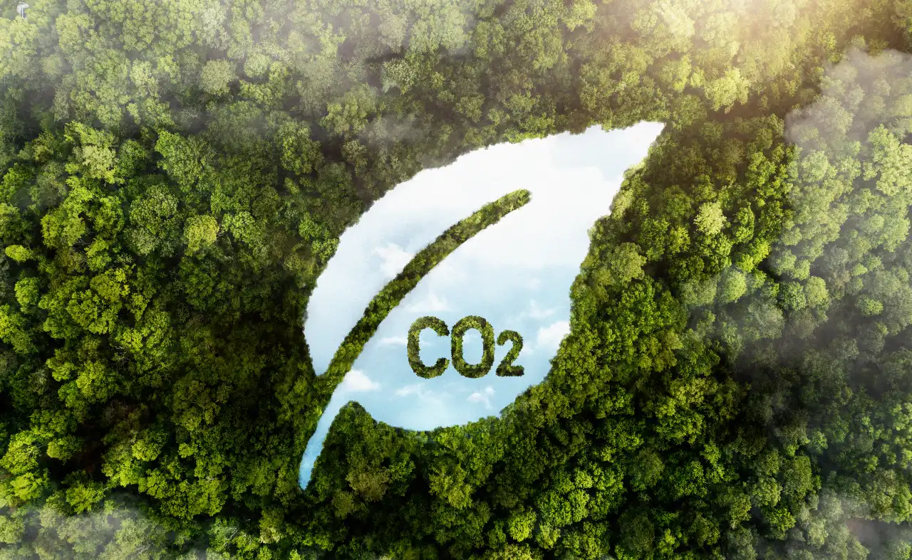
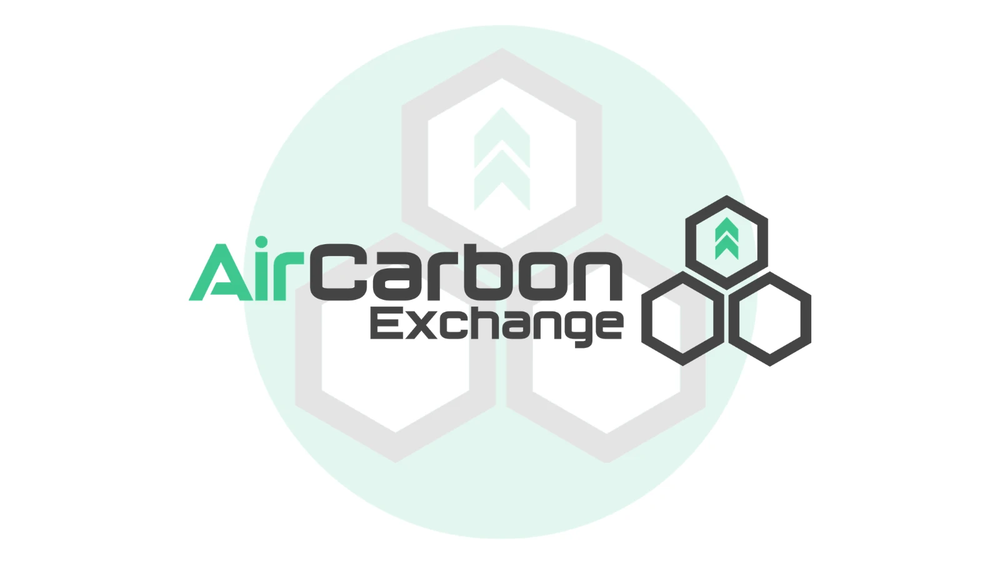
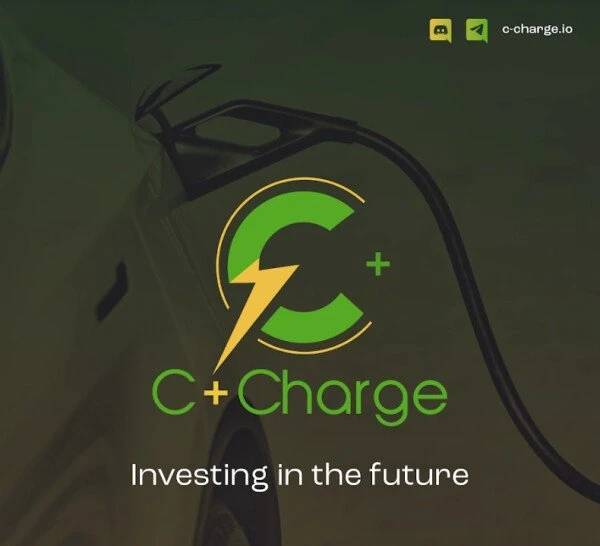

# 區塊鏈與碳交易市場的親密關係

2022年可以說是加密貨幣寒冬的一年，但即使如此，有一個領域正在悄悄地和區塊鏈結合發展：碳信用與碳抵銷市場。

這個結合是因為，應用區塊鏈技術似乎有機會解決碳抵銷市長長期存在的問題。其中最大的問題包括「如何驗證一個碳信用額度的獨一無二性」、如何確保碳信用額度被「退役」，以及避免重複計算等等。

而這些問題，皆是區塊鏈技術已經解決的應用場景，結合區塊鏈去中心化帳本技術，有助於確保碳抵銷項目方不會重複販售同一噸的減排碳信用額度。

因此，一個新興的領域悄悄地冒出新芽了：碳加密貨幣（Carbon Crypto）。這個領域興起有幾個趨勢同時出現，以下介紹碳加密貨幣生態系統的三大趨勢：

## **趨勢一：低碳排區塊鏈**

.webp)
https://www.freepik.com/free-photo/large-coin-placed-top-black-computer-keyboard_9932185.htm#query=ETH%202%200&position=7&from_view=search&track=ais

加密貨幣最為人詬病的，大概就是「挖礦」的能源消耗帶來的碳排放量。

2019 年研究顯示，比特幣開採過程產生了 2200 萬噸二氧化碳當量，大致相當於[荷蘭全國家的二氧化碳排放量](https://www.nbcnews.com/tech/tech-news/big-bitcoins-carbon-footprint-rcna920)。而就算是加密貨幣友善的新聞來源也指出，2020、2021的碳排甚至更高，達到3600 萬噸和 4100 萬噸。

而事實上，即便這個數字看起來非常龐大，其實若以全球的觀點來看，比特幣開採所產生的碳排放只佔了全球總碳排的 [0.08%](https://cryptonews.com/news/bitcoin-mining-co2-footprint-below-008-of-global-total-coinshares.htm)。

不論如何，加密貨幣圈正在往更低能耗、高效率的方向發展，例如以太坊 2.0 將驗證機制從傳統的 PoW 的轉型到 PoS 等方法，藉此降低 99.95% 的能源消耗。

## 趨勢二：碳信用額度貨幣化

https://moss.earth/

區塊鏈技術如 NFT（Non-Fungible Token）具有不可取代性、不可合併、可銷毀等特性，因此特別適合應用於碳信用額度。

即使今年經濟發展低迷，碳抵銷全球市場並不見放緩跡象，預計在2030年時將達到數十億美元規模。這個市場成長之快，且應用範圍之廣，也讓碳信用的驗證與退役作業程序充滿了挑戰。

目前看來，區塊鏈技術可以幫助解決部分挑戰，且已經有實際應用案例。例如碳抵銷交易平台 Moss 將碳抵銷開發項目所核發的碳信用貨幣化，讓每一噸的減排量對應到一個 [MCO2](https://www.coinbase.com/pt/price/moss-carbon-credit)，藉此使得購買碳抵銷更加方便。

Moss (MCO2) 是位於巴西的區塊鏈新創公司，他們創建了第一個碳信用虛擬貨幣，最近在加密貨幣交易所 Coinbase 上市。

目前為止，Moss 經手交易額度達到 2000 萬美元，藉由和已驗證的 REDD 和 REDD+ （減少森林砍伐所產生的減排）碳抵銷項目合作，保護了亞馬遜地區約 7.35 億棵樹木。

而 Moss 也成立為期30年的保育運轉基金，並且將亞馬遜雨林保育地做成 NFT 販售，提供購買者認養雨林地資助保育工作。 

MCO2 已被全球 300 多家公司應用於碳中和計畫，比較知名的案例： Moss 提供碳信用額度給 One River Asset Management 的碳中和比特幣基金。

Moss 也與擁有世界第五大波音機隊，巴西最大的航空公司 GOL 合作，允許旅客通過購買 MCO2 代幣來抵消排放，合作交易量超過 230 萬 MCO2，佔全球每年交易的碳信用總量的 2% 以上。

其他區塊鏈項目例如 [SavePlanetEarth](https://saveplanetearth.io/) 則是第一個將黃金標準（Golden Standard）碳抵銷驗證標準納入其 NFT 計劃的項目。

這些項目大多數處於早期階段，目前仍然缺乏有效的績效評估方法與紀錄，但是將碳抵銷計畫與區塊鏈技術結合已經證明可以解決重複計算問題，未來會如何發展，值得關注。

## 趨勢三：區塊鏈驅動的碳交易所

https://www.aircarbon.co/about-aircarbon

虛擬貨幣可以在中心化的交易所（例如：幣安、Coinbase）上進行買賣，而碳信用額度也開始有這個趨勢。

NFT 或 虛擬貨幣化的碳信用額度已經開始在一些應用區塊鏈技術的碳交易所上買賣，例如，阿拉伯聯合大公國的首都阿布扎比已經藉由在 [AirCarbon Exchange](https://www.aircarbon.co/about-aircarbon) 上購買碳抵銷而成為世界上第一個達成碳中和目標的城市。

[AirCarbon Exchange](https://www.aircarbon.co/carbon-assets) 於 2019 年在新加坡成立，當時是專為航空公司所設立的碳信用數位交易平台，而現今已經是碳交易平台的前三名。

該公司在 3 輪融資中總共籌集了 360 萬美元的資金，由德意志交易所資助。

該碳交易所在傳統商品交易架構中使用分佈式賬本技術 (DLT)，也使用[區塊鏈技術](https://carboncredits.com/blockchain-use-in-carbon-markets/)的速度和效率創建證券化的碳信用額度，實現即時 T-0 交易執行、清算和結算。

### 其他應用案例

https://cryptonews.com/news/c-charge-is-disrupting-the-ev-charging-industry-with-carbon-credit-rewards-heres-how-to-invest-in-the-presale.htm

有些項目同時符合這三個主要發展趨勢，例如[劍橋大學正在開發一個碳信用交易平台](https://www.coindesk.com/business/2021/11/10/cambridge-university-to-build-carbon-credit-marketplace-on-blockchain/ )，預計將建構於低碳排放、生態友善且採用 PoS 機制的 Tezos 區塊鏈上。

[CryptoCarbons NFT ](https://opensea.io/collection/crypto-carbons)則將碳信用數位藝術化，將已經驗證核發的碳信用額度與 NFT 畫作結合，而碳信用買家也可以要求產生其專屬的 NFT 藝術。

過去，碳信用的交易買賣似乎是大公司、甚至整座城市的單位在進行的遊戲。而現在，因為區塊鏈技術應用，這個情況正在改變。

碳抵銷計畫事實上不一定是特定項目開發方的權利，一般民眾生活中，也有許多減排的作法，當有足夠多人進行，聚沙成塔之下也會形成一股可觀的減排力量。而其中一項民眾可做的減排作法，就是換購電動車。

[C+Charge](https://c-charge.io/en) 是一個電動車充電樁生態系，他們與 Flowcarbon 合作創建了一個區塊鏈驅動的解決方案，達成碳抵銷全民化的目標。

[Flowcarbon](https://www.flowcarbon.com/tokens) 是一家位於紐約的氣候科技公司， 其主要目標是通過代幣化碳信用額來降低碳交易門檻，加速碳信用額度流通，利用 Web3的技術保護地球的天然碳匯。他們推出的貨幣就叫做 GNT，相當於一噸的二氧化碳減排當量，由風險投資公司 a16z Crypto、Samsung Next 和基金經理 Invesco 背書。

而在他們合作的充電樁生態系中，電動車駕駛可以購買 C+Charge 推出的虛擬貨幣 CCHG 來支付充電費用，並獲得 GNT 的碳信用額度獎勵，因此提升一般人換購電動車的誘因，達成碳抵銷計畫民主化的目標。

### 碳信用應用於區塊鏈的批評

然而，將區塊鏈技術應用於碳抵銷項目上，仍然是有相當多的批評聲音。

最明顯的當然是區塊鏈運算高能耗產生的高碳排放，讓人質疑這是否是一件本末倒置的做法。

聯合國資助成立的碳市場觀察組織（Carbon Market Watch）內部人員 Gilles Dufrasne 認為，在區塊鏈上交易碳信用額度不會使對氣候產生任何好處。 「這只是舊酒裝新瓶，或者更糟，只是用加密貨幣泡泡建構新的漂綠機器」。

而碳抵銷長久以來的詬病：[項目過度膨風](https://www.fern.org/fileadmin/uploads/fern/Documents/2003.11%20-%20Forest%20fraud_say%20no%20to%20fake%20credits.pdf)，並未達成所宣稱的減排數量；而石化公司藉由購買碳抵銷來合理化，甚至「碳中和」自身開採石油、燃燒石化燃料的生意，讓碳信用淪為贖罪卷，也是碳抵銷長期以來的問題，這些都不會因為區塊鏈技術應用而獲得解決

除此以外，加密貨幣市場過度投機的文化似乎也是一個問題。

黃金標準（Gold Standard）首席技術官兼[氣候帳本倡議](https://www.climateledger.org/en/About.12.html)（Climate Ledger Initiative） 的聯合創始人 Owen Hewlett 對區塊鏈技術潛力頗為樂觀，認為碳市場的現任者對如何使用區塊鏈推進氣候行動和金融民主化有很多想法，但加密貨幣企業家並沒有聽取老手的意見。

「這似乎更多地是為了抓住加密貨幣泡沫，而不是利用該技術做好事。 那樣的話，我們將錯失良機。」

碳抵銷市場正在強勢成長中，即使過去曾因為規範設計不良產生許多漂綠的疑慮，仍然是國際社會邁向淨零承諾的必然手段之一。

但即便碳抵銷市場蓬勃發展，這個手段仍然只是企業經過盤查、減排努力之後的「最後一哩路」。針對自身碳排放妥善盤查，從數據獲得深入洞察，並且制定減排計劃，啟動永續轉型等，才是企業真正應該要努力的課題。

從數據獲得深入洞察，藉此制定有效可追蹤的減排計劃，皆為資料科學的應用場景。櫛構科技使用大數據 AI，結合GIS 演算系統，協助企業車隊打造量身定做的自動化碳管理平台，協助一同落地永續轉型。

除了隨手關燈，我們可以[做更多](https://combogic.com/#contact)

https://www.climatechangenews.com/2022/08/19/world-bank-launches-carbon-credit-blockchain-registry-to-attract-crypto-investors/
https://carboncredits.com/carbon-crypto-guide-klimadao-carbon-nfts-and-carbon-tokens/#2
https://carboncredits.com/tesla-drivers-can-earn-carbon-credits-ccharge-ing-evs/