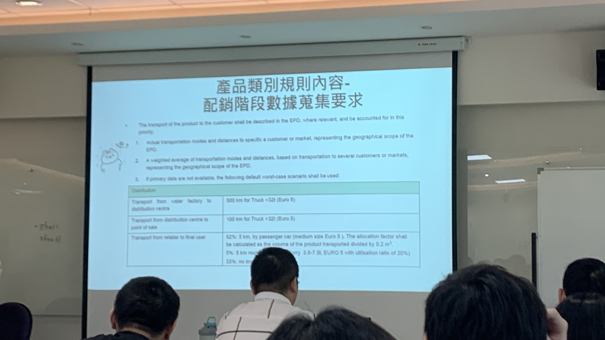

產品類別規則並非國際通用，通常優先使用國內的 PCR，假設沒有既定的 PCR，那可以去草案的區塊找找看（ PCR 提案申請與草案預告），可能是正在申請中。「預備」是最開始，「草案二」是最後確認的版本。

在環保署的 PCR 產品類別規則網站上，都是大方向的類別，不一定會有特定的產品。

所以假設你要找「可飲用」的「桶裝」的「海洋深層水」，那不可能會找得到，反之應該回去找類別，比如找到「瓶裝水」，並且確認該 PCR 的文件內容「適用對象類別」是否有

CCC Code 也只是標出一個類別，是進出口貿易稅務使用，所以也不會詳細地界定這件事。

（圖 2-7）

三種常見產品類別規則
（表格 p.2-5 ）
環保署 CF-PCR
EPD-PCR
EU PEFCR

如果連這裡也沒有的話，那就從國際產品類別規則去找： EPD

EPD 是世界上第一個 PCRF 創建者，也是目前 PCR Library 的營運者，只要註冊會員不用付費就可以看。

進入 PCR Library 就可以開始搜尋。要註冊會員

EU PEFCR 目前沒有人知道會不會更新，用處也不明未定，非常不好算。

CBAM 算碳排放的標準還沒有出來，所以目前沒有人知道會不會用 EU PEFCR，這個算起來就會非常的困難，因為非常嚴苛且很複雜。

### 如何選擇適用哪一種產品類別？

通常從名字下去對應

也可以用製造商品分類號列（CCC Code）去搜尋歸類，但這個是進出口商才在用的。

同時也必須確認有無在分類中被排除的產品，例如「吸收性衛生產品」裡面也會排除掉什麼什麼

### 如何發展 PCR

資料下載區有範本

### PCR 的內容

1. 一般資訊

主要重要的是適用對象類別

2. 產品範疇界定

描述機能、組成、特性。

不知道怎樣寫時可以參考類似類別的寫作方法。

### 功能單位與參考流

 **功能單位（functional unit） vs. 宣告單位（declared unit）**：

簡單來說，功能單位是指一個東西的所發揮的「功能」上的量測單位，例如在建築中一個隔熱材料就可以用 1.5 m2/WK 的單位（每週提供 1.5 平方公尺的隔熱能力）來作為功能單位。

或者例如運輸服務的功能單位是「延人公里」（passenger-kilometer），而宣告單位則是「每人-每公里」（1pkm, one passenger over one kilometer）

例如油漆，宣告單位當然很簡單，就是一桶幾公升或重量
但是功能單位要從功能來看，是提供建築牆壁的裝潢和保護，要多少可以覆蓋一平方公尺基材？效果覆蓋多少？維持多久的年限？

有些油漆可能就可以撐很久，有些很爛。

功能單位就是「提供那個功能的強度單位」，而參考流就是「在特定功能強度（以功能單位衡量）之下，所需要的產品數量」。因此參考流是拿來做比較的，例如照亮一間工廠需要 25 顆鎢絲燈泡，但是特定技術的 LED 燈泡可能只需要一顆，因此就可以比較出能耗。

如果該產品的功能不好歸類或者有多個功能，那就只會有宣告單位，例如平方公尺、厚度（mm）這些我們常見的單位。

- 參考流（reference flow）：
https://www.youtube.com/watch?v=kPAxhofylEA

A reference flow is a quantified amount of the product(s), including product parts, necessary for a specific product system to deliver the performance described by the functional unit.

For a composite product, the reference flow will typically be identical to the parts list of the product, multiplied by a factor to scale it to the functional unit. 

The purpose of the reference flows is to translate the abstract functional unit into specific product flows for each of the compared systems, so that product alternatives are compared on an equivalent basis, reflecting the actual consequences of the potential product substitution.
（The Product, Functional Unit and Reference Flows in LCA. ）

### 生命週期範圍的考量

搖籃到墳墓

搖籃到大門

產品類別規則內容裡會寫清楚個階段哪些東西要算，哪些不用算。

例如 智慧型手機

因為台灣自產智慧型手機的工廠很少，所以這份智慧型手機的 PCR 已經很久沒有更新了。

另一點是，像是在系統邊界界定，主要元件跟其他元件的定義要非常清楚，否則一堆零件都是自願性納入的範疇不用計算，那就整支都變成零碳手機，這樣不合理。

### 系統邊界

時間性、地理性、自然界、技術系統等等都可以是分類系統邊界的方法。

時間性：穩定生產的產品以整年為優先考慮，而客製品或者季節性產品則選定特定季節或者最近一批產量考慮。

地點性：標的產品在調查期間內生產鎖在工廠的位置

自然邊界：跟環境有關的議題，到底要算到哪裡才算是結束？廢棄物法規會說，你的責任到哪裡就算到哪裡。

而基礎設施（例如上課或活動用的教室）就不用納入，但是歐洲有些法規就會，那樣有點太細了，實務上就會是直接引用排放係數來算，不然還要算建築物碳足跡、壽命、使用頻率等等太難。

### 切斷原則（cut off criteria）

台灣產品碳足跡計算中，如果排放源貢獻少於 1% 時，就不算；累計不可以超過 5%。

切掉的量不能就這樣沒了，還要把算出來的 95% 擴大還原成 100%。你只是計算上省掉一些過程，不能省掉量。

### 分配規則

什麼是分配規則？基本上就是「當你要計算的對象跟其他東西混再一起時，要怎樣分配碳排量給你的對象才合理」。

例如一間生產瓶裝水的公司，但可以再配送階段是跟其他 B 公司 C 公司一起配送，那就要去算怎樣攤運輸使用的燃料。

或者台鹽同樣一間工廠，總用電量可能同時用來生產鹽巴跟海洋深層水，那多少的電量算在鹽巴身上？多少電量用在水上面？你可以用詳細的製程來看，但那就會很複雜也會很有爭議。

而或者，同樣一間教室給人辦活動，你要怎樣分配電量？當物理性質的量（重量、體積、長度...）沒辦法用來分配時，用經濟價值分配也是一種方式：賺最多錢的分配到最多用電量。但這樣當然會遇到反彈。所以這塊是會有爭議的。

原則上是先看物理性質，再來才看經濟價值，但是能夠不要分就不要分。

廢棄物的分配規則則是污染者付費原則。

### 數據搜集要求

#### 原料

環保署規定：如果組織自己的溫室氣體排放不到 10% 其他都是上游的，那上游就必須要用一級活動數據。

一級數據怎樣取得？可以量測電力投入量、供應商在特定時間中消耗的資源平均分配在產品上，或者其他 14064 盤查的常見數據搜集方法。

（2-30 圖）
原料取得階段如果使用二手零件或再生材料，那要怎樣搜集數據？

基本上因為上游資料獲取很難，所以頂多只能拿處理的工廠活動數據（用電、資源投入）來算一個最基本的值。

#### 製造

#### 配送

配送流程非常複雜，而且通常真的要每一條都算，貢獻強度可能沒有那麼高（低於 5%），那究竟怎樣簡化？

（2-32 圖）

環保署的 PCR 只抓出數據最大宗，用農民那邊運出來的數據，也是因為只有這個可以拿到。

EPD 的計算法就會從製造到中盤，中盤到零售，這些原則是如果你不知道數據，那就要用一個替代的數字來做。

國內則是補上不足就好，例如如果不知道數據，就用交通部汽車貨運調查報告的平均運送距離作為替代用數據。

### 使用

只有 B2C 類別的才會要算，不外乎就是用電或用水。

因為不可能知道使用者習慣，所以會有一個盡量合理的情境設定，例如電鍋就會設定可以用 10 年，一天用兩小時（每天煮兩次一次一小時）、保溫 1.5 小時（每日兩次，一次 45 分鐘）、以電鍋機械式恆溫器壽命是 8000 次，一天使用兩次約是使用 10 年。

情境設定盡量以簡單，最基本的情境為主，想得越複雜PCR就越難用。可以參考環保署 PCR 裡面各大產品的情境設定

常見的另外兩種國外 PCR 也有

### 生命終結

## 衝擊呈現

除了呈現碳足跡還要呈現最多 16 個的環境衝擊：

溫室效應
臭氧層破壞
淡水生態毒性
人類毒性：癌症
人類毒性：非癌症
顆粒物質....共 16 種。

目前還在檢討中，未來可能還會再增加，這些方法學也會繼續更新。

另外排放廢棄物、能資源耗竭等等呈現有些 PCR 就會出現特殊細項告訴你怎樣呈現衝擊情形。

最後台灣環保署的 PCR 則會有碳足跡標章格式、位置、大小等。

如果是 EPD 也會在 Reporting format 上做特別要求。（5.4 EPD REPORTING FORMAT）

總體來說，碳足跡盤查的誤差空間以及模糊空間其實還是非常大，尤其是台灣環保署的最不嚴格，而 EPD 國際版本的稍微嚴格一點，而最嚴格的則是歐盟的 EU PEFRC，前兩者 PCR 可能都是二十幾頁，但是後者就動輒上百頁，模糊空間就小很多。

